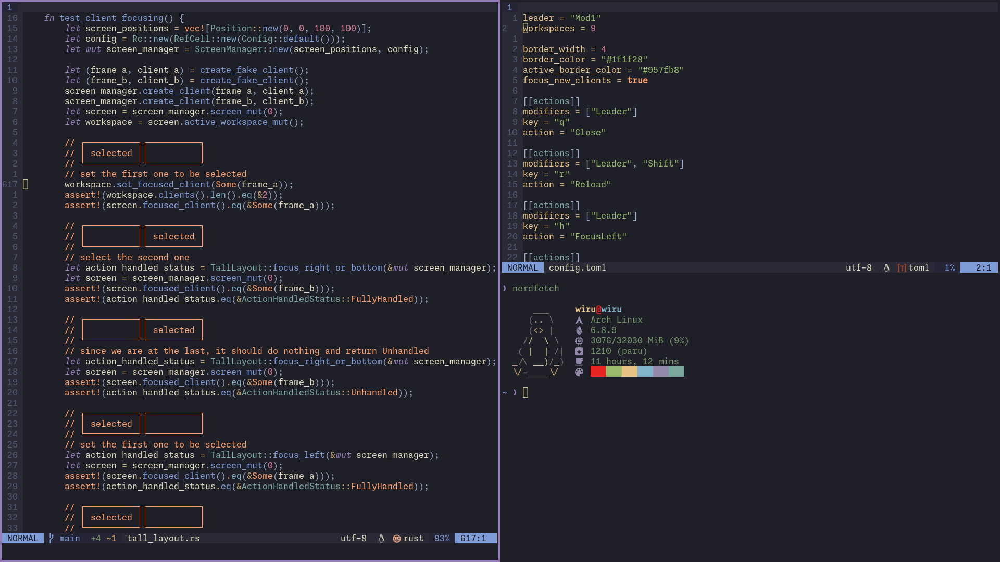

# LuckyWM

Minimal, flexible and customizable, window manager for X.

### Note

Lucky is in heavy development and not ready for use, new features are being added
in a fast pace.

### Features

- [x] Multi-monitor support
- [x] Tiling layout
- [x] Multiple desktops
- [x] Window focus follows mouse
- [x] Custom keybinds for actions and commands
- [x] Startup programs and commands
- [x] Customizable decorations
- [ ] Gaps
- [ ] Floating layout
- [ ] Status bar
- [ ] Compositor support

### Configuring

Lucky will look for a configuration file in the following places:
1. If set, the value from `LUCKY_CONFIG` will be used;
2. If set, the value from `$XDG_CONFIG_HOME` will be used;
3. If exists, the file in `$HOME/.config/lucky` will be used;
4. If none of the above applies, the default configuration will be loaded, with a warning
